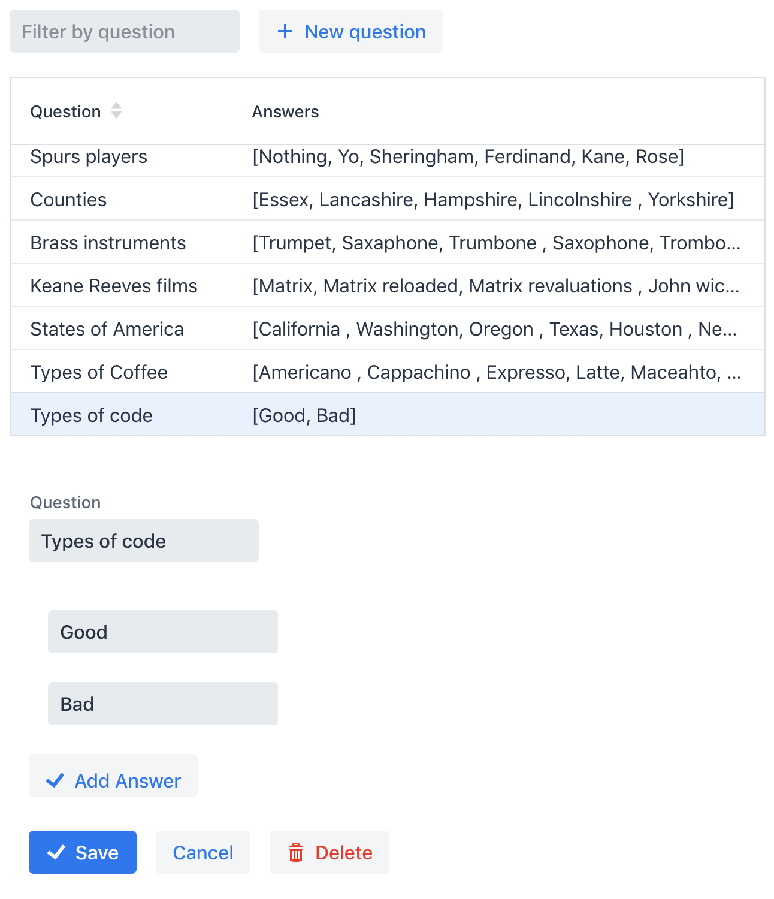

# First to 100 Backend

This is a Spring Boot application, which provides an admin console of questions and answers
for the 'First to 100' game frontend, returning them from a REST API.

Travis is used for CI, with master being continuously deployed to Heroku.

### Swagger docs
https://first-to-100-game.herokuapp.com/swagger-ui.html

### Screenshot
